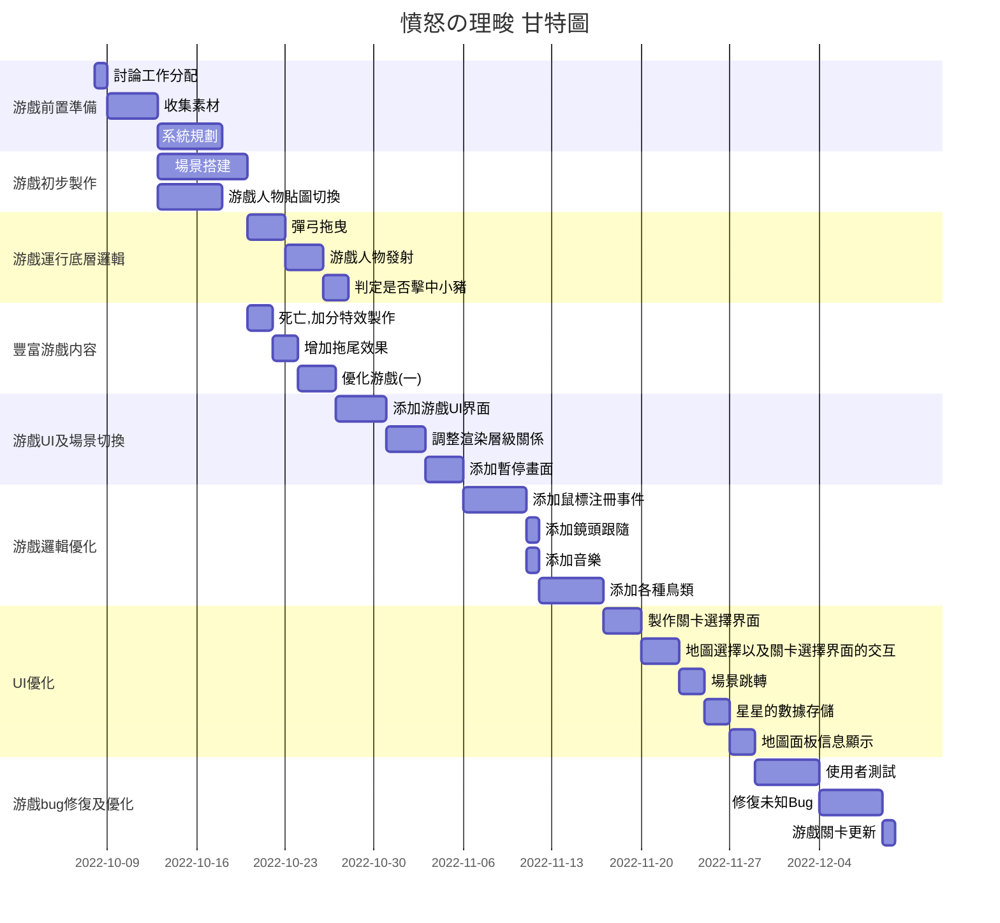

# 111-1_SA-D_group11

# 111-1_SA-D_group11

# Group01 - MY's Team

---

### 組員名單：

| 職位 | 學號 | 名字 | 任務 |
| :--: | :--: | :--: | :---: |
| *組長* | C109118254 |[羅睿宸]() | 任務規劃與分配 |
| 組員 | C109118219 | [夏辰旭](https://github.com/sean89858448/SA-D/blob/main/README.md) | 程式碼編輯 |
| 組員 | C109118210 | [王昱仁]() | 甘特圖繪製 |
| 組員 | C109118249 | [戴御軒](https://github.com/BEnser16/2022-3B.git) | 任務規劃與分配 |
| 組員 | C109118263 | [秦玟康]() | 任務規劃與分配 |

---
###  組員任務
|名字|任務|
|:--:|:--:|
|龔玖恩| 前置準備，工作分配，底層邏輯，邏輯優化，Bug修復，圖表製作，使用者測試|
|張理畯| 前置準備，初步製作， UI製作及場景切換 ，UI優化，使用者測試|
|蘿義康| 前置準備，豐富游戲内容，邏輯優化，UI優化，使用者測試|
|李佳燕| 前置準備，底層邏輯，豐富游戲内容，PPT製作，GITHUB製作，使用者測試|

---
# 專題介紹
### 專題名稱： *憤怒の理畯*
### 目的：
提供大家一種解壓方式，消磨時間，促進感情
### 内容：
控制正義的小鳥打敗偷鳥蛋的理畯

## 憤怒の理畯 甘特圖

## 憤怒の理畯 PERT圖

### 溫馨提示:
#### 如看不清圖片請點擊查看大圖
