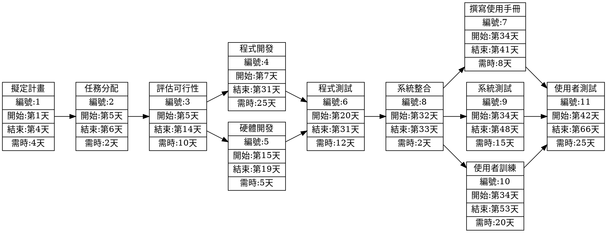

```graphviz
digraph{
node[shape=record];
    rankdir="LR";
    no1 [label = "擬定計畫 | 編號:1 | 開始:第1天 | 結束:第4天 | 需時:4天"]
    no2 [label = "任務分配 | 編號:2 | 開始:第5天 | 結束:第6天 | 需時:2天"]
no3 [label = "評估可行性 | 編號:3 | 開始:第5天 | 結束:第14天 | 需時:10天"]
    no4 [label = "程式開發 | 編號:4 | 開始:第7天 | 結束:第31天 | 需時:25天"]
    no5 [label = "硬體開發 | 編號:5 | 開始:第15天 | 結束:第19天 | 需時:5天"]
    no6 [label = "程式測試 | 編號:6 | 開始:第20天 | 結束:第31天 | 需時:12天"]
    no7 [label = "撰寫使用手冊 | 編號:7 | 開始:第34天 | 結束:第41天 | 需時:8天"]
    no8 [label = "系統整合 | 編號:8 | 開始:第32天 | 結束:第33天 | 需時:2天"]
    no9 [label = "系統測試 | 編號:9 | 開始:第34天 | 結束:第48天 | 需時:15天"]
    no10 [label = "使用者訓練 | 編號:10 | 開始:第34天 | 結束:第53天 | 需時:20天"]
    no11 [label = "使用者測試 | 編號:11 | 開始:第42天 | 結束:第66天 | 需時:25天"]
 no1->no2 
 no2->no3
 no3->no4
 no3->no5
 no4->no6
 no5->no6
 no6->no8
 no8->no7
 no8->no9
 no8->no10 
 no7->no11
 no9->no11
 no10->no11
}
```