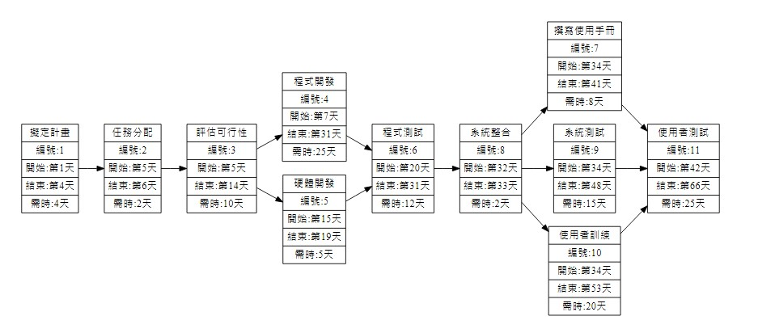
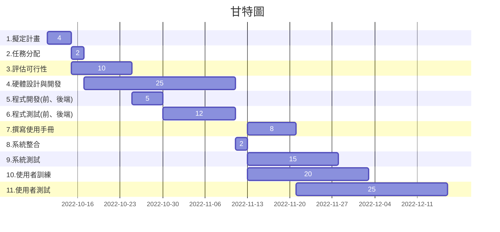

# 111-1_SA-D_group11  

---  

### 組員名單：  

| 職位 | 學號 | 名字 | 任務 |
| :--: | :--: | :--: | :---: |
| **組長** | C109118254 |[羅睿宸](https://github.com/c109118254/noco) | 任務規劃與分配 |
| 組員 | C109118219 | [夏辰旭](https://github.com/sean89858448/SA-D) | 硬體開發 |
| 組員 | C109118210 | [王昱仁]() | 後端系統開發 |
| 組員 | C109118249 | [戴御軒](https://github.com/BEnser16/2022-3B.git) | 前端系統開發 |
| 組員 | C109118263 | [秦玟康](https://github.com/Wenkang99/C109118263) | 撰寫使用者手冊 |

---

## 專題題目： **智慧倉儲**
## 內容 : 透過室內定位尋找設備位置：
    1.UWB定位功能開發並建立座標。
    2.獲取Beacon定位位置。
    3.設計標籤系統，標記設備編號、時間、地點。
    4.資料自動上傳至網路平台。

---

+ ### 任務清單
    
    | **步驟** | **說明** | **需時天數** | **前置步驟** |
    | :---: | :---: | :---: | :---: |
    | 1 | 擬定計畫 | 2 | - |
    |  2 | 任務分配 | 1 | 1 |
    |  3 | 評估可行性 | 20 | 2 |
    |  4 | 硬體設計與開發 | 20 | 2 |
    |  5 | 程式開發(前、後端) | 20 | 2 |
    |  6 | 程式測試(前、後端) | 10 | 3、4 |
    |  7 | 撰寫使用手冊 | 7 | 5 |
    |  8 | 系統整合 | 7 | 5 |
    |  9 | 系統測試 | 7 | 6 |
    | 10 | 使用者訓練 | 7 | 6 |
    | 11 | 使用者測試 | 7 | 8 |
   
  
  
**(1)PERT/CPM圖**
---
[PERT/CPM](https://hackmd.io/@wwXnxhdVTL6v14eGTSBJdg/BJaUE69Qs)

  
---
  

