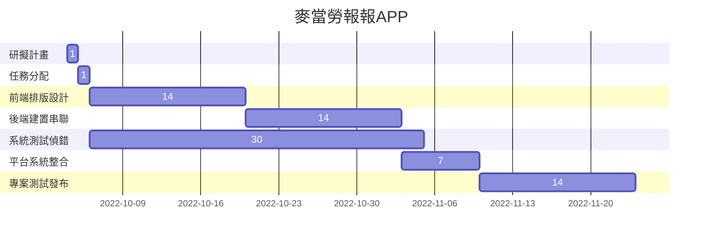

# 111-1_SA-D_group11  

---  

### 組員名單：  

| 職位 | 學號 | 名字 | 任務 |
| :--: | :--: | :--: | :---: |
| *組長* | C109118254 |[羅睿宸]() | 任務規劃與分配 |
| 組員 | C109118219 | [夏辰旭](https://github.com/sean89858448/SA-D/blob/main/README.md) | 後端系統開發 |
| 組員 | C109118210 | [王昱仁]() | 甘特圖繪製 |
| 組員 | C109118249 | [戴御軒](https://github.com/BEnser16/2022-3B.git) | 前端系統開發 |
| 組員 | C109118263 | [秦玟康]() | 撰寫使用者手冊 |

---

+ ### 任務清單
    
    | **步驟** | **說明** | **需時天數** | **前置步驟** |
    | :---: | :---: | :---: | :---: |
    | 1 | 研擬計畫 | 2 | - |
    | 2 | 任務分配 | 1 | 1 |
    | 3 | 程式開發(前端) | 20 | 2 |
    | 4 | 程式開發(後端) | 20 | 2 |
    | 5 | 程式測試(前後端) | 10 | 3、4 |
    | 6 | 撰寫使用手冊 | 7 | 5 |
    | 7 | 系統測試 | 7 | 5 |
    | 8 | 使用者訓練 | 7 | 6 |
    | 9 | 使用者測試 | 7 | 8 |
    
---

# 專題介紹
### 專題名稱： *麥當勞報報APP*
### 目的：
做一個更好的麥當勞報報
### 内容：
每日抽獎獎勵優化

## 麥當勞報報APP

