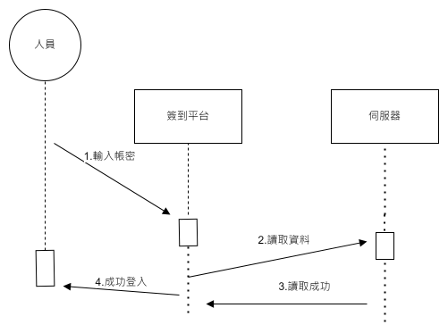

# 111-1_SA-D_group11  

---  

### 組員名單：  

| 職位 | 學號 | 名字 | 任務 |
| :--: | :--: | :--: | :---: |
| **組長** | C109118254 |[羅睿宸](https://github.com/c109118254/noco) | 任務規劃與分配 |
| 組員 | C109118219 | [夏辰旭](https://github.com/sean89858448/SA-D) | 硬體開發 |
| 組員 | C109118210 | [王昱仁]() | 後端系統開發 |
| 組員 | C109118249 | [戴御軒](https://github.com/BEnser16/2022-3B.git) | 前端系統開發 |
| 組員 | C109118263 | [秦玟康](https://github.com/Wenkang99/C109118263) | 撰寫使用者手冊 |

---

## 專題題目： **智慧倉儲**
## 內容 : 透過室內定位尋找設備位置：
    1.UWB定位功能開發並建立座標。
    2.獲取Beacon定位位置。
    3.設計標籤系統，標記設備編號、時間、地點。
    4.資料自動上傳至遠端監控平台。

---

+ ### 任務清單
    
    | **步驟** | **說明** | **需時天數** | **前置步驟** |
    | :---: | :---: | :---: | :---: |
    | 1 | 擬定計畫 | 2 | - |
    |  2 | 任務分配 | 1 | 1 |
    |  3 | 評估可行性 | 20 | 2 |
    |  4 | 硬體設計與開發 | 20 | 2 |
    |  5 | 程式開發(前、後端) | 20 | 2 |
    |  6 | 程式測試(前、後端) | 10 | 3、4 |
    |  7 | 撰寫使用手冊 | 7 | 5 |
    |  8 | 系統整合 | 7 | 5 |
    |  9 | 系統測試 | 7 | 6 |
    | 10 | 使用者訓練 | 7 | 6 |
    | 11 | 使用者測試 | 7 | 8 |
   
  
  
**(1)PERT/CPM圖**
---
[PERT/CPM](https://hackmd.io/@wwXnxhdVTL6v14eGTSBJdg/BJaUE69Qs)

  
---
  

## WEEK6小組作業: 

## 功能性需求與非功能性需求
  
### 功能性需求
  1. 室內定位技術。
  2. Beacon位置。
  3. 標籤系統。
  4. 遠端監控平台。
  
### 非功能性需求
    1. 反應性: 提供監控人員隨時查詢資料
    2. 使用性: 標籤系統連結建築物室內架構
    3. 效能:   同步上傳定位位置至監控平台

# 功能分解表

  

# 需求分析文字描述
## 一個智慧倉儲系統的需求分析簡述如下 : 
1.管理者可藉由標籤系統查看工廠人員動向。  
2.管理者可藉由標籤系統查看設備位置。  
3.工廠人員可透過定位進行簽到。  
4.工廠人員可進行手動簽到。  
5.設備透過AMR進行搬運。  
6.設備位置於標籤系統中定位。  

# 案例圖及案例說明
## 案例圖

   

### 案例說明(一)
| 使用案例名稱 | 安裝定位點 |
| --- | --- |
| 行動者 | 管理者 |
| 說明 | 安裝定位所需設備 |
| 完成動作 | 1. 將定位點設置於場域中  2. 透過有線或無線方式連接行車紀錄器 |
| 先決條件 | 購買定位設備 |
| 後置條件 | 查看定位點 |

### 案例說明(二)
| 使用案例名稱 | 工廠人員簽到 |
| --- | --- |
| 行動者 | 工廠人員 |
| 說明 | 工廠人員於場所內進行簽到 |
| 完成動作 | 1. 工廠人員進入場所 |
| 先決條件 | 工廠人員進入場所 |
| 後置條件 | 資料進行更新 |

### 案例說明(三)
| 使用案例名稱 | 定位設備位置 |
| --- | --- |
| 行動者 | 無人搬運車 |
| 說明 | AMR搬運設備至目的地 |
| 完成動作 | 1. 設備安裝定位點 2. 獲取定位訊息 3. 透過MAP得知設備位置 |
| 先決條件 | 設備安裝定位點 |
| 後置條件 | 查看設備位置 |

# Figma
  *  [Figma網址](https://www.figma.com/file/BtX1cha3D8xi7A3DT5QmYy/%E6%99%BA%E6%85%A7%E5%80%89%E5%84%B2%E7%B3%BB%E7%B5%B1?node-id=0%3A1&t=1uQND3Ncfn0iSUmi-1)

## WEEK7小組作業: 請各組新增 以下兩項工作
1.繪出系統環境圖 (DFD)

2.繪製DFD 圖0 (須至少有三項以上的程序)

---
### 繪出系統環境圖 (DFD)

---
### 繪製DFD圖0 (須至少有三項以上的程序)
  

##week8

## UML類別圖

## 使用案例1
### 循序圖

### 活動圖

## 使用案例2
### 循序圖

### 活動圖

## 使用案例3
### 循序圖

### 活動圖

